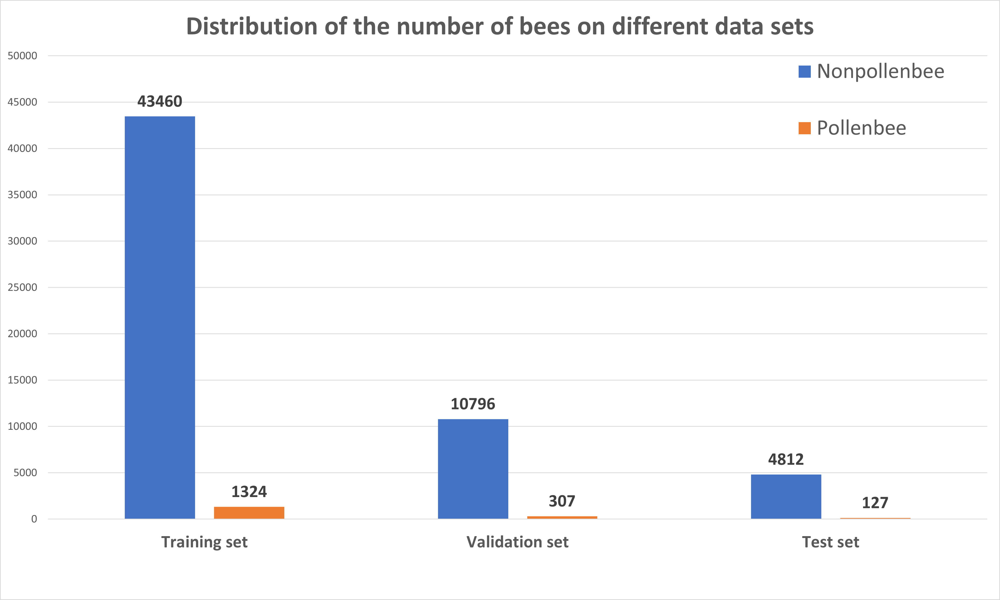
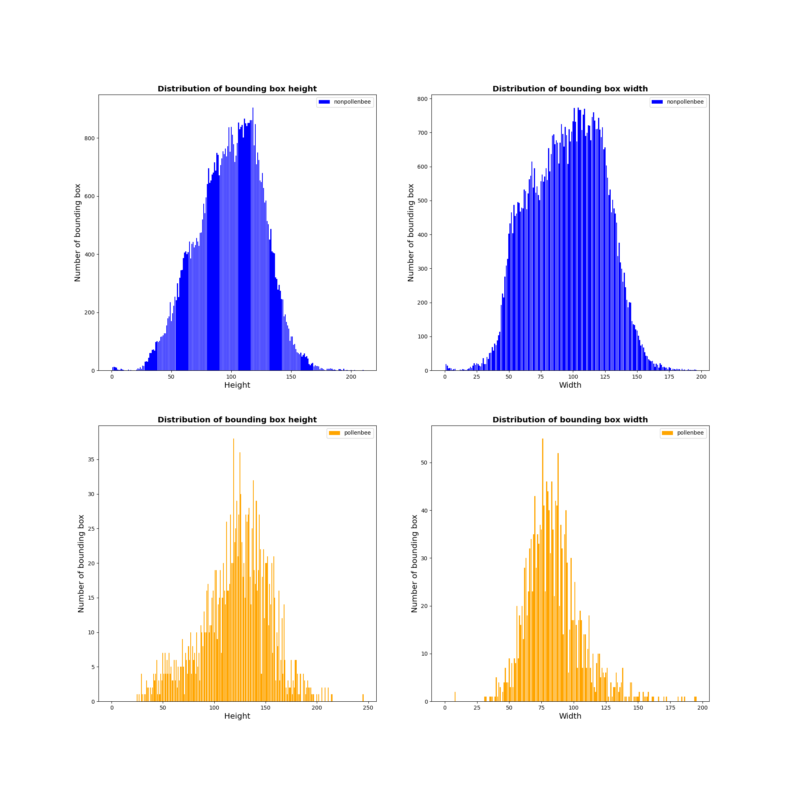

# The Pollenbee Dataset
_"Improving pollen-bearing honey bee detection from videos captured at hive entrance by combining deep learning and handling imbalance techniques"_

The Pollenbee Dataset is built for the purpose of serving the problem of detecting pollen bees. The dataset contains more than **2000 images**consisting of **1,758 pollen bearing** and **59,068 non-pollen bearing bees**. 

The dataset was collected at the bee farm of the Vietnam Agricultural Academy by a data acquisition system consisting of an Nvidia jetson nano development kit and an IMX477 HQ camera with a 6mm CS-Mount lens, all devices are placed in a housing surveillance weatherproof outdoor camera box. We adjust the camera along with the downward-facing view. We attach the housing surveillance weatherproof outdoor camera box within only one stage of the hive body. Our data acquisition system:


Example of video collected by our data acquisition system:


# Details
We collect data as videos over many days, each video lasts **1 minute**, each day from 6 am to 5:30 pm, and each time is separate 30 minutes to obtain images at different times with different natural light conditions and a different number of bees. All videos were recorded in the resolution of **1920x1080 at 60 fps**. Next figure show some examples of dataset in different light conditions:


Based on observations on captured videos, pollen-bearing bees are usually present from 8:30 a.m. to 11 a.m., so we selected videos during those times to create the dataset. The pollen-bearing bees in the dataset varied in size as well as the color of pollen the bees carried. Figure below shows examples of pollen-bearing bees in our dataset:


The number of each object class in the dataset is shown in the following table:

| id| Label        | Object class           | Instances |
|:--|:-------------|:-----------------------|:----------|
| 1 | nonpollenbee | Non pollen-bearing bee | 59068     |
| 2 | pollenbee    | Pollen-bearing bee     | 1758      |
|   |              | **Total:**             | 60826     |

The dataset was annotated manualy first by Labelme Annotation tools and then by a object detection model trained on the annotated dataset. Next figure show the annotation process by Labelme Annotation Tool.


The PollenBee dataset was divided into 3 sets: training set, validation set, and test set at the ratio 0.7:0.2:0.1. Finally, the training set: 1496 images, the validation set: 381 images, and the test set: 174 images. Figure below shows the distribution of the number of bees among classes in different sets:



Next figure shows the distribution of the length and width of the bounding boxes in PollenBee dataset. We can see that the size of the bounding box is quite variable (pollen-bearing bee: width in range [50,100px], height in range [100,150px]).



<!-- # Citation
If you find useful the Pollenbee dataset for your research, please cite the paper:
```js
// Javascript code with syntax highlighting.
var fun = function lang(l) {
  dateformat.i18n = require('./lang/' + l)
  return true;
}
``` -->

# Download
The dataset can be downloaded [here](https://drive.google.com/drive/folders/1fdEcu7CNmEkVAamu9wh_Ppw_-uW3VNY1?usp=share_link) or in the download link (red) on the left side of the screen. The dataset has been divided into training sets, validation sets and test sets with the ratio of 70:20:10. You can use this divided dataset to compare the results we obtained or you can re-divide the data set to achieve the best results.